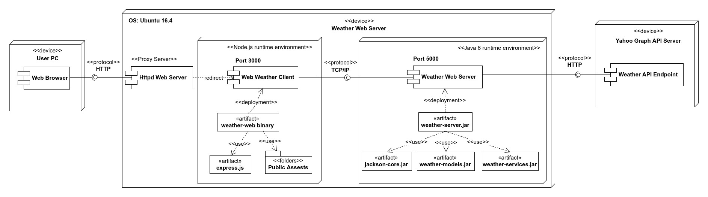
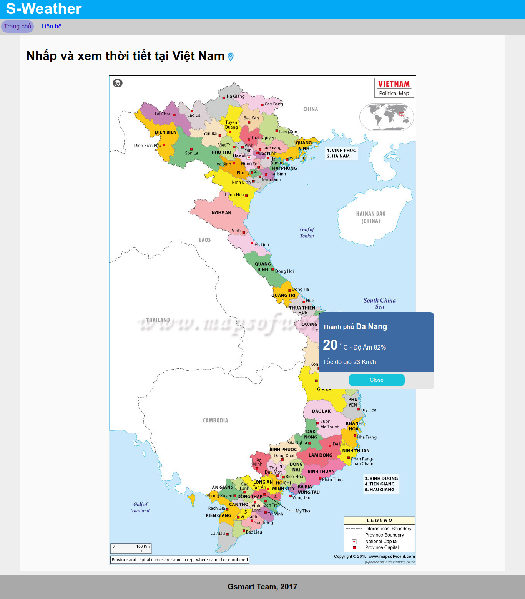
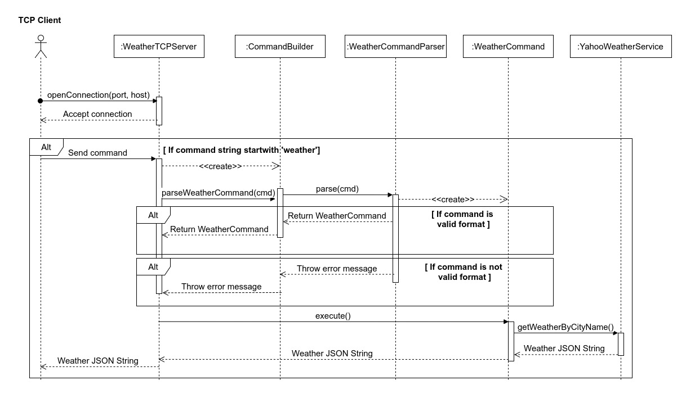

# 1. Yêu cầu và mục đích chọn đề tài 

### 1.1  Yêu cầu đề tài 
 
Dự án này thuộc đồ án cơ sở ngành mạng, một đồ án nằm trong chương trình học đào tạo kỹ sư công nghệ thông tin. Đồ án cơ sở ngành mạng bao gồm hai phần.

1) Phần thứ nhất là chủ đề về hệ điều hành.
2) Phần thứ hai là chủ để lập trình mạng.

Dự án này thuộc về phần thứ hai của đồ án này.

**Tên đề tài**

Mô phỏng chương trình dự báo thời tiết

**Yêu cầu đề tài** 

- Chương trình Client biểu diễn thông tin dự báo thời tiết, cho phép
người dùng chọn vùng để xem.
- Chương trình Server phân tích xử lý thông tin dự báo thời tiết ở một số
trang Web để trả về cho client.

Đây là đề tài do thầy Mai Văn Hà yêu cầu và hướng dẫn.


### 1.2) Mục đích chọn đề tài 

**Thứ nhất**, em chọn đề tài này vì sản phẩm cuối cùng của nó sẽ là một ứng dụng nhỏ có thể tra cứu thông tin thời tiết của các vùng được chọn, đây là một sản phẩm nhỏ mà bạn có thể dùng được mỗi ngày. Việc tạo ra một sản phẩm có thể dùng được sẽ tạo cho bạn động lực tốt hơn và xem nó như là một thành quả của bản thân. 

**Thứ hai**, đây là một đề tài có kiểu giao tiếp client-server đây là mô hình phổ biến nhất hiện nay, em có thể xây dựng client là một website và tiến hành giao tiếp với server để truyền nhận dữ liệu, đây là một kỹ thuật thường gặp trong mọi ứng dụng. 

Bên cạnh đó em còn có thể kết hợp để sử dụng một số kỹ thuật hay dùng ở website như là xây dựng giao diện bằng HTML và CSS, hay truyền nhận và xử lý dữ liệu bằng Javascript thông qua AJAX. 

Qua những kỹ thuật trên em sẽ hiểu được một website hoạt động như thế nào, và vai trò của một server là ra sao, giúp hình dung tốt hơn về cách tạo ra một website theo mô hình client-server.


### 1.3) Phân tích đề tài và phương án giải quyết 

 Qua yêu cầu đề tài, thì đầu tiên em tự đặt ra các câu hỏi như sau và tìm cách trả lời những câu hỏi đó. 
 
 **a) Dữ liệu thời tiết sẽ lấy ở trang web nào và bằng cách nào ?**
 
 Qua tìm hiểu và tra cứu trên mạng thì Yahoo Weather là một trong những ứng viên sáng giá nhất, với khả năng lấy dữ liệu thông qua một  Graph API Endpoint.
 
Chúng ta chỉ việc truyền vào một đối số chính là tên địa danh mà chúng ta muốn tra cứu thông tin thời tiết thì Endpoint này sẽ trả về cho chúng ta đầy đủ thông tin thời tiết về địa điểm đó.
 
 **Ví dụ về truy vấn thông tin**
  
 Chúng ta sẽ gọi một truy vấn HTTP trên method GET với URI như sau 
 
 ```
 https://query.yahooapis.com/v1/public/yql?q=select * from weather.forecast where woeid in (select woeid from geo.places(1) where text='Da Nang')&format=json
 ``` 

 Trong đó `https://query.yahooapis.com/v1/public/yql` chính là URI Endpoint để truy vấn thông tin thời tiết, Endpoint này chấp nhận một query param là `q` chứa một câu lệnh YQL (Yahoo Query Language - là một ngôn ngữ truy vấn được định nghĩa ra bởi Yahoo Inc). 
 
 Câu lệnh này có nội dung như sau 
 
 `select * from weather.forecast where woeid in (select woeid from geo.places(1) where text='Da Nang')`

Ý nghĩa của câu lệnh trên là để lấy thông tin thời tiết của nơi có tên định danh chứa hoặc bằng giá trị `text` trong câu truy vấn.

Ở đây mình đặt `text` bằng giá trị `Da Nang` nghĩa là mình muốn truy vấn thông tin thời tiết của thành phố Đà Nẵng, Việt Nam. 

Và kết quả trả về mình muốn ở Dạng JSON nên mình sẽ thêm vào một đối số là `format=json` như vậy thì kết quả trả về sẽ có định dạng JSON.

**Mẫu kết quả trả về từ truy vấn trên**


```json 
{  
   "query":{  
      "count":1,
      "created":"2017-12-21T08:19:44Z",
      "lang":"vi-VN",
      "results":{  
         "channel":{  
            "units":{  },
            "title":"Yahoo! Weather - Da Nang, Da Nang, VN",
            "description":"Yahoo! Weather for Da Nang, Da Nang, VN",
            "language":"en-us",
            "lastBuildDate":"Thu, 21 Dec 2017 03:19 PM ICT",
            "ttl":"60",
            "location":{  },
            "wind":{  },
            "atmosphere":{  },
            "astronomy":{  },
            "image":{  },
            "item":{  }
         }
      }
   }
}
```

Trong đó các bạn thấy có đầy đủ thông tin về thành phố Đà Nẵng, các thuộc tính mình quan tâm đó là `wind` chứa thông tin về tốc độ gió, `atmosphere` chứa thông tin bầu khí quyển (tầm nhìn, độ ẩm) và `item` chứa các thông tin về dự đoán thời tiết, và quan trọng hơn hết là `units` chứa thông tin về các đơn vị đo được sử dụng.

Lần lượt chúng ta sẽ tìm hiểu dữ liệu chưa trong các khối thông tin quan trọng trên.

Đầu tiên là phần `units` chứa thông tin về đơn vị đo 

```json 
"units":{  
  "distance":"mi",
  "pressure":"in",
  "speed":"mph",
  "temperature":"F"
}
``` 

Các bạn sẽ thấy rằng đơn vị đó tốc độ gió là mph, nhiệt độ là độ F và đơn vị đo khoảng cách là Mile (Dặm Anh) 1 dặm Anh xấp xỉ 1.6093 Km 

Ở Việt Nam thì chúng ta thường dùng thang đo là Km, Độ C và Km/h chính vì vậy khi hiển thị thì phải chuyển đổi về thang đo phù hợp để dễ đọc cho người Việt mình.

Tiếp theo là đến phần `wind` chứa thông tin về gió 

```json 
"wind":{  
   "chill":"68",
   "direction":"338",
   "speed":"22"
 }
```

Với `chill` là độ lạnh, `speed` là tốc độ còn `direction` là hướng gió.

Tiếp theo là phần `atmosphere` chứa thông tin về khí quyển 

```json 
"atmosphere":{  
  "humidity":"70",
  "pressure":"1016.0",
  "rising":"0",
  "visibility":"16.1"
}
```

Với `humidity` là độ ẩm tính theo % , `pressure` là áp lực không khí , `visibility` là tầm nhìn tính theo dặm Anh (Mile).


Tiếp đến đi sâu vào thuộc tính `item` và đi đến thuộc tính `condition` sẽ chứa thông tin về địa danh mà bạn đã chọn.

```json 
"condition":{  
   "code":"26",
   "date":"Thu, 21 Dec 2017 02:00 PM ICT",
   "temp":"68",
   "text":"Cloudy"
}
```

Trong đó các bạn quan tâm đến `text` chính là mô tả ngắn về thời tiết hiện tại, giá trị Cloudy chính là chỉ trời nhiều mây.


Từ các thuộc tính trên thì mình thấy thông thường khi cần thông tin về thời tiết thì các bạn sẽ cần biết các thông số sau là đủ

- **Tên địa danh** (query.location)
- **Ngày kết xuất** (query.item.condition.date)
- **Nhiệt độ** (query.item.condition.temp)
- **Độ ẩm** (query.atmosphere.humidity)
- **Tốc độ gió** (query.wind.speed)
- **Mô tả thời tiết hiện tại** (query.item.condition.text)

Ở trên chính là tên của các trường cần thiết và vị trí để lấy dữ liệu đó (JSON path) trong đối tượng JSON trả về.

**b) Công nghệ và ngôn ngữ lập trình nào sẽ được sử dụng ?**

Trong đồ án này thì mình quyết định sử dụng hai công nghệ đó là Java để xây dựng khối Server và Node.js để xây dựng khối Client.

Lý do chọn hai công nghệ này là vì Java có kiến trúc tổ chức mã lệnh tốt tuân thủ OOP, lại được sử dụng trong công việc và dạy học rất nhiều. Việc sử dụng Java để xây dựng khối Server dành cho việc truy vấn và xử lý dữ liệu là phù hợp nhất.

Bên cạnh đó mình chọn Node.js để xây dựng khối Client là vì Node.js cho phép xây dựng một website đơn giản rất nhanh, chi phí thấp và hiệu quả rất cao, ngoài ra Node.js lại còn là một công nghệ đang được ưa chuộng nhất thị trường lập trình website hiện nay.


**c) Khối Server viết bằng Java sẽ làm công việc gì ?**

Khối Server viết bằng Java sẽ nhận các tránh nhiệm sau:

1) Mở kết nối TCP tại một cổng nhất định để tiếp nhận các request gửi từ client lên và xử lý. 

2) Truy vấn đến Graph Endpoint của Yahoo để lấy dữ liệu thời tiết thông qua giao thức HTTP.

3) Xử lý dữ liệu định dạng JSON để tách lấy các trường dữ liệu cần thiết.

Để xử lý dữ liệu JSON bằng Java thì mình dùng bộ thư viện `Jackson JSON` đây là bộ thư viện có uy tín rất lâu và độ ổn định rất cao.

Khối Server viết bằng Java sẽ xử dụng `Apache Maven` là công cụ build tool để quản lý việc build project và các thư viện dependencies, nên việc các đặt thư viện `Jackson JSON` sẽ thông qua Maven Repository với định danh như sau: 


```maven
<!-- https://mvnrepository.com/artifact/com.fasterxml.jackson.core/jackson-core -->
<dependency>
    <groupId>com.fasterxml.jackson.core</groupId>
    <artifactId>jackson-databind</artifactId>
    <version>2.0.2</version>
</dependency>
```

**d) Khối Client viết bằng Node.js sẽ làm công việc gì ?**

Khối client viết bằng Node.js sẽ đảm nhiệm các công việc sau:

1) Mở kết nối HTTP server để người dùng truy cập và trả về giao diện website để người dùng tương tác.

2) Tiếp nhận yêu cầu địa danh từ người dùng gửi đến thông qua giao thức HTTP đến Client webserver rồi từ đó tạo kết nối TCP đến TCP Server viết bằng Java để gửi dữ liệu rồi chờ nhận kết quả trả về.

 
# 2. Sơ đồ triển khai 

Trước khi đi sâu vào phân tích chức năng và cách cài đặt từng phần thì em xin trình bày sơ đồ triển khai tổng quát của đồ án này.



Hình 2.1 - Sơ đồ triển khai ứng dụng thực tế trên môi trường Linux 

Trong mô hình trên khối server được chia thành 4 module nhỏ bao gồm: 

1) `weather-models.jar`  chứa các đối tượng dữ liệu và nghiệp vụ.
2) `weather-services.jar` chứa các đối tượng truy vấn dữ liệu từ Yahoo API Endpoint thông qua HTPP.
3) `jackson-core.jar` chứa các thư viện để thao tác với JSON.
4) `weather-server.jar` chứa các đối tượng để khởi tạo TCP Server để tiếp nhận và xử lý yêu cầu từ client.


Khối Server sẽ kết nối với Yahoo Endpoint thông qua HTTP để truy vấn dữ liệu thời tiết.

Khối Client được viết bằng Node.js có trách nhiệm cung cấp giao diện website để người dùng tương tác. Khối Client này sử dụng thư viện Express.js để tạo webserver. Ngoài ra để website vận hành còn cần có một thư mục web assets , thư mục này chứa các tệp tin HTML, JS, CSS và hình ảnh sử dụng cho website.

# 3. Cách triển khai chạy thử ứng dụng

Ứng dụng đã được build sẵn ra tệp tin thực thi cho hai hệ điều hành Linux và Windows.


### 3.1 Với hệ điều hành Linux 

.... Hướng dẫn ....

### 3.2 Với hệ điều hành Windows

..... Hướng dẫn .....


# 4. Hình ảnh chạy thử ứng dụng 

Sau khi khởi chạy ứng dụng có thể vào trình duyệt với đường dẫn 

http://localhost:3333/

Thì sẽ thấy giao diện website như dưới đây, để xem thời tiết thành phố nào, chỉ cần nhấp chuột vào thành phố đó, popup thông tin thời tiết về thành phố đó sẽ tự hiện ra.




Hình 3.1 - Chạy thử ứng dụng và xem thông tin thời tiết thành phố Đà Nẵng.


# 5. Sơ đồ hoạt động mô tả nghiệp vụ hệ thống 

Để có cái nhìn tổng quát về luồng nghiệp vụ và luồng thông tin đi trong ứng dụng mỗi khi có yêu cầu tra cứu thời tiết từ trình duyệt người dùng, thì em xin trình bày sơ đồ hoạt động tổng của ứng dụng như sau.


 

# 6. Sơ đồ tuần tự mô tả nghiệp vụ truy vấn thông tin thời tiết ở TCP Server 

Để phân tích sâu hơn vào mã lệnh bên trong, thì đầu tiên mình sẽ giới thiệu sơ đồ tuần tự mô tả các tương tác sẽ xảy ra trong nghiệp vụ xử lý truy vấn thông tin thời tiết từ client gửi đến server.



Client sẽ gửi lên server một câu lệnh có dạng như sau 

```sh
weather --city [NAME_OF_CITY] --format json
```

Đoạn lệnh trên khi gửi lên server thì sẽ nhận được thông tin thời tiết của thành phố có tên `[NAME_OF_CITY]` và định dạng là JSON.

Để nhận được request từ client gửi lên thì server sẽ mở ra một kết nối ở cổng 5000 và liên tục kiểm tra kết nối đến với đoạn lệnh sau.

```java
  while (true) {
   try {
    Socket socket = serverSocket.accept();
    System.out.println("New Client " + socket.getInetAddress());

    new Thread(new HandleRequest(socket)).start();
   } catch (SocketTimeoutException e) {
    // Do nothing.
   } catch (IOException e) {
    System.err.println(e);
   }
  }
```

Để đáp ứng được nhiều client cùng lúc thì sẽ xử lý các request trên mỗi luồng riêng biệt. Mỗi khi có client kết nối đến thì đoạn mã lệnh xử lý sẽ như sau: 

```java 
 public class HandleRequest implements Runnable {
  Socket socket;

  public HandleRequest(Socket socket) {
   this.socket = socket;
  }

  public void run() {
   try {
    DataOutputStream out = new DataOutputStream(socket.getOutputStream());
    DataInputStream in = new DataInputStream(socket.getInputStream());

    // Read command string from client.
    String cmdString = in .readUTF();
    Command command = null;

    try {
     if (cmdString.startsWith("weather")) {
      command = CommandBuilder.parseWeatherCommand(cmdString);
     }
     // Allow more check blocks here.
     else {
      throw new NotFoundCommand(cmdString + " not found.");
     }
    } catch (InvalidCommand | NotFoundCommand e) {
     out.writeUTF(e.getMessage());
     socket.close();
    }

    if (command != null) {
     out.writeUTF(command.execute().getString());
    }

    out.close();
    socket.close();
   } catch (IOException e) {
    System.err.println(e);
   }
  }

 }
```

Kiểm tra chuỗi lệnh gửi lên tương ứng với Command nào thì gọi CommandPaser tương ứng ra xử lý. Đoạn mã trên áp dụng Command Pattern, với cách xử lý như vậy chúng ta có thể linh hoạt thêm nhiều câu lệnh khác để đáp ứng nhu cầu được phong phú hơn.

Tương ứng với mỗi CommandPaser, mỗi paser có nhiệm vụ lấy các đối số từ chuỗi lệnh ra để làm dữ liệu đầu vào cho đối tượng Command tương ứng.

Cụ thể với WeatherCommandPaser thì sẽ làm như sau:

```java 
public class WeatherCommandParser {
 /**
  * Parsing given string command for get config data.
  * 
  * @param cmd
  * 
  * @return WeatherCommand
  * @throws InvalidCommand
  */
 static WeatherCommand parse(String cmd) throws InvalidCommand {
  int cityNameIndex = cmd.indexOf("--city=\"");
  String cityName;

  if (cityNameIndex != -1) {
   cityName = cmd.substring(cityNameIndex + 8, cmd.indexOf("\"", cityNameIndex + 8));
  } else {
   throw new InvalidCommand("Argument --city not found.");
  }

  return new WeatherCommand(cityName);
 }
}
``` 

Nếu câu lệnh thiếu hoặc các tham số dòng lệnh không phù hợp thì sẽ bị ném ra ngoại lệ, nếu phù hợp thì khởi tạo và trả về đối tượng `WeatherCommand` đối tượng này có phương thức execute() sẽ trả về dữ liệu thời tiết của thành phố truyền vào.

Mã lệnh của WeatherCommand là như sau:

```java 
package vn.edu.sociss.services.tcp;

import vn.edu.sociss.services.api.YahooWeatherService;
import vn.edu.sociss.services.api.YahooWeatherServiceImpl;

public class WeatherCommand implements Command {
 private String cityName;

 public WeatherCommand(String cityName) {
  this.cityName = cityName;
 }

 public Response execute() {
  YahooWeatherService service = new YahooWeatherServiceImpl();
  String data = service.getWeatherByCityName(cityName).toString();

  return new Response(data);
 }

 public String getCityName() {
  return cityName;
 }

 public void setCityName(String cityName) {
  this.cityName = cityName;
 }
}
```

Trong đó để có thể lấy được dữ liệu về thời tiết thì WeatherCommand sẽ gọi 
phương thức `getWeatherByCityName` của lớp `YahooWeatherService`, đối tượng `YahooWeatherService` sẽ kết nối đến Yahoo Graph Endpoint để lấy dữ liệu thời tiết.

Mã lệnh của đối tượng `YahooWeatherService` sẽ như sau.

```java 
package vn.edu.sociss.services.api;

import java.io.IOException;
import java.net.MalformedURLException;
import java.net.URI;
import java.net.URISyntaxException;

import com.fasterxml.jackson.databind.JsonNode;
import com.fasterxml.jackson.databind.ObjectMapper;

import vn.edu.sociss.models.Weather;
import vn.edu.sociss.services.https.HttpHelper;
import vn.edu.sociss.services.https.HttpResponse;
import vn.edu.sociss.services.https.SimpleHTTPHelper;

public class YahooWeatherServiceImpl implements YahooWeatherService {
 String API_URL = "https://query.yahooapis.com/v1/public/yql";

 public Weather getWeatherByCityName(String cityName) {
  ObjectMapper mapper = new ObjectMapper();

  String requestQuery = "q=select * from weather.forecast " + "where woeid in (select woeid from geo.places(1) " + "where text='" + cityName + "')&format=json";
  HttpHelper http = new SimpleHTTPHelper();

  try {
   URI uri = new URI("https", "query.yahooapis.com", "/v1/public/yql", requestQuery, null);
   HttpResponse res = http.get(uri.toASCIIString());

   // Do parsing JSON data.
   JsonNode root = mapper.readTree(res.getBody());
   JsonNode channel = root.path("query").path("results").path("channel");
   // Here is two fields contain needed data.

   JsonNode location = channel.path("location");
   JsonNode wind = channel.path("wind");
   JsonNode condition = channel.path("item").path("condition");

   // Get Data
   final int _temp = condition.path("temp").asInt();
   final int _windSpeed = wind.path("speed").asInt();
   final String _cityName = location.path("city").asText() + " " + location.path("conutry");

   return new Weather(_cityName, _temp, _windSpeed);
  } catch (MalformedURLException e) {
   e.printStackTrace();
  } catch (IOException e) {
   e.printStackTrace();
  } catch (URISyntaxException e) {
   e.printStackTrace();
  } catch (SecurityException e) {
   e.printStackTrace();
  }

  return null;
 }
}
```

Với dữ liệu trả về từ Yahoo Endpoint là mỗi chuỗi JSON nên sẽ sử dụng thư viện Jackson API để phân tích sau đó tương ứng với các JSON path để lấy ra dữ liệu cần thiết, cụ thể 

- **Tên địa danh** (query.location)
- **Ngày kết xuất** (query.item.condition.date)
- **Nhiệt độ** (query.item.condition.temp)
- **Độ ẩm** (query.atmosphere.humidity)
- **Tốc độ gió** (query.wind.speed)
- **Mô tả thời tiết hiện tại** (query.item.condition.text)

Như đã đề cập ở phần phân tích. Trong đoạn mã trên `Weather` là đối tượng đóng vai trò DTO (Data Transfer Object) để các lớp nghiệp vụ khác có thể thực thi các tính toán dễ dàng hơn.


