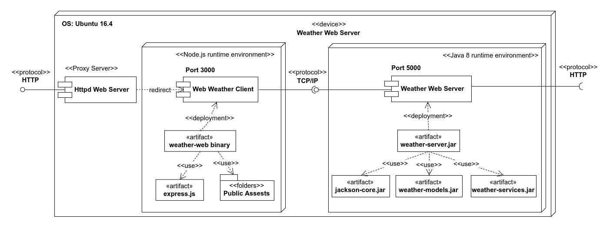
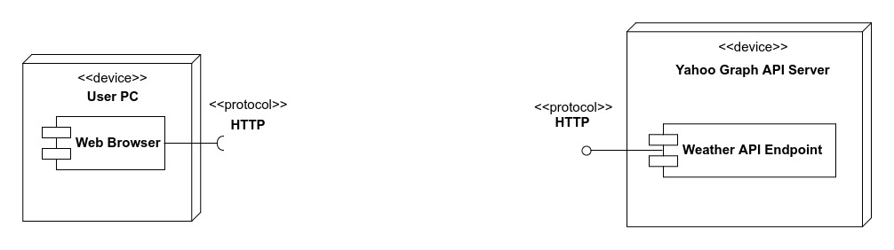
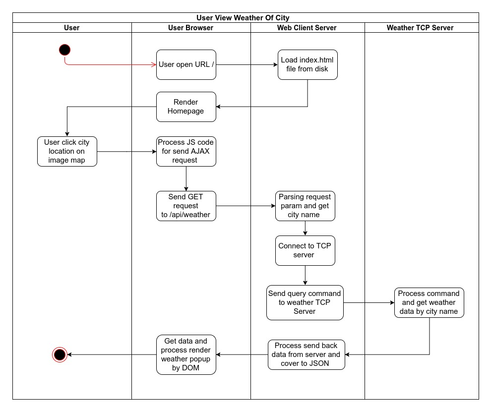
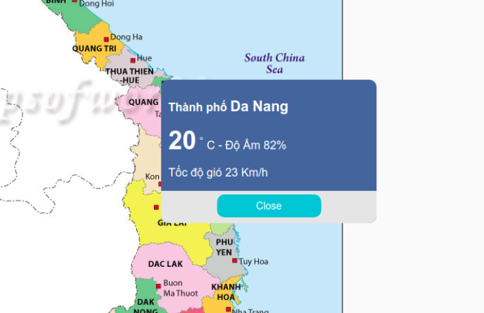

# Mục Lục 

**1) Yêu cầu và mục đích chọn đề tài** 

+ Yêu cầu đề tài
+ Mục đích chọn đề tài
+ Phân tích đề tài và phương án giải quyết
  
**2) Sơ đồ triển khai**

**3) Cách triển khai chạy thử ứng dụng**

+ Chạy trên hệ điều hành Linux 
+ Chạy trên hệ điều hành Windows 
     
**4) Hình ảnh chạy thử ứng dụng**

**5) Sơ đồ hoạt động mô tả nghiệp vụ hệ thống**

**6) Nghiệp vụ truy vấn thông tin thời tiết ở TCP Server**

**7) Nghiệp vụ truy vấn và hiển thị thông tin thời tiết ở Website Client**

**8) Kiến thức học được qua đồ án**

**9) Phương án mở rộng**

**10) Kết luận**


# 1. Yêu cầu và mục đích chọn đề tài 

### 1.1  Yêu cầu đề tài 
 
Dự án này thuộc đồ án cơ sở ngành mạng, một đồ án nằm trong chương trình học đào tạo kỹ sư công nghệ thông tin. Đồ án cơ sở ngành mạng bao gồm hai phần.

1) Phần thứ nhất là chủ đề về hệ điều hành.
2) Phần thứ hai là chủ để lập trình mạng.

Dự án này thuộc về phần thứ hai của đồ án này.

**Tên đề tài**

Mô phỏng chương trình dự báo thời tiết

**Yêu cầu đề tài** 

- Chương trình Client biểu diễn thông tin dự báo thời tiết, cho phép
người dùng chọn vùng để xem.
- Chương trình Server phân tích xử lý thông tin dự báo thời tiết ở một số
trang Web để trả về cho client.

Đây là đề tài do thầy Mai Văn Hà yêu cầu và hướng dẫn.


### 1.2) Mục đích chọn đề tài 

**Thứ nhất**, em chọn đề tài này vì sản phẩm cuối cùng của nó sẽ là một ứng dụng nhỏ có thể tra cứu thông tin thời tiết của các vùng được chọn, đây là một sản phẩm nhỏ mà bạn có thể dùng được mỗi ngày. Việc tạo ra một sản phẩm có thể dùng được sẽ tạo cho bạn động lực tốt hơn và xem nó như là một thành quả của bản thân. 

**Thứ hai**, đây là một đề tài có kiểu giao tiếp client-server đây là mô hình phổ biến nhất hiện nay, em có thể xây dựng client là một website và tiến hành giao tiếp với server để truyền nhận dữ liệu, đây là một kỹ thuật thường gặp trong mọi ứng dụng. 

Bên cạnh đó em còn có thể kết hợp để sử dụng một số kỹ thuật hay dùng ở website như là xây dựng giao diện bằng HTML và CSS, hay truyền nhận và xử lý dữ liệu bằng Javascript thông qua AJAX. 

Qua những kỹ thuật trên em sẽ hiểu được một website hoạt động như thế nào, và vai trò của một server là ra sao, giúp hình dung tốt hơn về cách tạo ra một website theo mô hình client-server.


### 1.3) Phân tích đề tài và phương án giải quyết 

 Qua yêu cầu đề tài, thì đầu tiên em tự đặt ra các câu hỏi như sau và tìm cách trả lời những câu hỏi đó. 
 
 **a) Dữ liệu thời tiết sẽ lấy ở trang web nào và bằng cách nào ?**
 
 Qua tìm hiểu và tra cứu trên mạng thì Yahoo Weather là một trong những ứng viên sáng giá nhất, với khả năng lấy dữ liệu thông qua một  Graph API Endpoint.
 
Chúng ta chỉ việc truyền vào một đối số chính là tên địa danh mà chúng ta muốn tra cứu thông tin thời tiết thì Endpoint này sẽ trả về cho chúng ta đầy đủ thông tin thời tiết về địa điểm đó.
 
 **Ví dụ về truy vấn thông tin**
  
 Chúng ta sẽ gọi một truy vấn HTTP trên method GET với URI như sau 
 
 ```
 https://query.yahooapis.com/v1/public/yql?q=select * from weather.forecast where woeid in (select woeid from geo.places(1) where text='Da Nang')&format=json
 ``` 

 Trong đó `https://query.yahooapis.com/v1/public/yql` chính là URI Endpoint để truy vấn thông tin thời tiết, Endpoint này chấp nhận một query param là `q` chứa một câu lệnh YQL (Yahoo Query Language - là một ngôn ngữ truy vấn được định nghĩa ra bởi Yahoo Inc). 
 
 Câu lệnh này có nội dung như sau 
 
 `select * from weather.forecast where woeid in (select woeid from geo.places(1) where text='Da Nang')`

Ý nghĩa của câu lệnh trên là để lấy thông tin thời tiết của nơi có tên định danh chứa hoặc bằng giá trị `text` trong câu truy vấn.

Ở đây mình đặt `text` bằng giá trị `Da Nang` nghĩa là mình muốn truy vấn thông tin thời tiết của thành phố Đà Nẵng, Việt Nam. 

Và kết quả trả về mình muốn ở Dạng JSON nên mình sẽ thêm vào một đối số là `format=json` như vậy thì kết quả trả về sẽ có định dạng JSON.

**Mẫu kết quả trả về từ truy vấn trên**


```json 
{  
   "query":{  
      "count":1,
      "created":"2017-12-21T08:19:44Z",
      "lang":"vi-VN",
      "results":{  
         "channel":{  
            "units":{  },
            "title":"Yahoo! Weather - Da Nang, Da Nang, VN",
            "description":"Yahoo! Weather for Da Nang, Da Nang, VN",
            "language":"en-us",
            "lastBuildDate":"Thu, 21 Dec 2017 03:19 PM ICT",
            "ttl":"60",
            "location":{  },
            "wind":{  },
            "atmosphere":{  },
            "astronomy":{  },
            "image":{  },
            "item":{  }
         }
      }
   }
}
```

Trong đó các bạn thấy có đầy đủ thông tin về thành phố Đà Nẵng, các thuộc tính mình quan tâm đó là `wind` chứa thông tin về tốc độ gió, `atmosphere` chứa thông tin bầu khí quyển (tầm nhìn, độ ẩm) và `item` chứa các thông tin về dự đoán thời tiết, và quan trọng hơn hết là `units` chứa thông tin về các đơn vị đo được sử dụng.

Lần lượt chúng ta sẽ tìm hiểu dữ liệu chưa trong các khối thông tin quan trọng trên.

Đầu tiên là phần `units` chứa thông tin về đơn vị đo 

```json 
"units":{  
  "distance":"mi",
  "pressure":"in",
  "speed":"mph",
  "temperature":"F"
}
``` 

Các bạn sẽ thấy rằng đơn vị đó tốc độ gió là mph, nhiệt độ là độ F và đơn vị đo khoảng cách là Mile (Dặm Anh) 1 dặm Anh xấp xỉ 1.6093 Km 

Ở Việt Nam thì chúng ta thường dùng thang đo là Km, Độ C và Km/h chính vì vậy khi hiển thị thì phải chuyển đổi về thang đo phù hợp để dễ đọc cho người Việt mình.

Tiếp theo là đến phần `wind` chứa thông tin về gió 

```json 
"wind":{  
   "chill":"68",
   "direction":"338",
   "speed":"22"
 }
```

Với `chill` là độ lạnh, `speed` là tốc độ còn `direction` là hướng gió.

Tiếp theo là phần `atmosphere` chứa thông tin về khí quyển 

```json 
"atmosphere":{  
  "humidity":"70",
  "pressure":"1016.0",
  "rising":"0",
  "visibility":"16.1"
}
```

Với `humidity` là độ ẩm tính theo % , `pressure` là áp lực không khí , `visibility` là tầm nhìn tính theo dặm Anh (Mile).


Tiếp đến đi sâu vào thuộc tính `item` và đi đến thuộc tính `condition` sẽ chứa thông tin về địa danh mà bạn đã chọn.

```json 
"condition":{  
   "code":"26",
   "date":"Thu, 21 Dec 2017 02:00 PM ICT",
   "temp":"68",
   "text":"Cloudy"
}
```

Trong đó các bạn quan tâm đến `text` chính là mô tả ngắn về thời tiết hiện tại, giá trị Cloudy chính là chỉ trời nhiều mây.


Từ các thuộc tính trên thì mình thấy thông thường khi cần thông tin về thời tiết thì các bạn sẽ cần biết các thông số sau là đủ

- **Tên địa danh** (query.location)
- **Ngày kết xuất** (query.item.condition.date)
- **Nhiệt độ** (query.item.condition.temp)
- **Độ ẩm** (query.atmosphere.humidity)
- **Tốc độ gió** (query.wind.speed)
- **Mô tả thời tiết hiện tại** (query.item.condition.text)

Ở trên chính là tên của các trường cần thiết và vị trí để lấy dữ liệu đó (JSON path) trong đối tượng JSON trả về.

**b) Công nghệ và ngôn ngữ lập trình nào sẽ được sử dụng ?**

Trong đồ án này thì mình quyết định sử dụng hai công nghệ đó là Java để xây dựng khối Server và Node.js để xây dựng khối Client.

Lý do chọn hai công nghệ này là vì Java có kiến trúc tổ chức mã lệnh tốt tuân thủ OOP, lại được sử dụng trong công việc và dạy học rất nhiều. Việc sử dụng Java để xây dựng khối Server dành cho việc truy vấn và xử lý dữ liệu là phù hợp nhất.

Bên cạnh đó mình chọn Node.js để xây dựng khối Client là vì Node.js cho phép xây dựng một website đơn giản rất nhanh, chi phí thấp và hiệu quả rất cao, ngoài ra Node.js lại còn là một công nghệ đang được ưa chuộng nhất thị trường lập trình website hiện nay.


**c) Khối Server viết bằng Java sẽ làm công việc gì ?**

Khối Server viết bằng Java sẽ nhận các tránh nhiệm sau:

1) Mở kết nối TCP tại một cổng nhất định để tiếp nhận các request gửi từ client lên và xử lý. 

2) Truy vấn đến Graph Endpoint của Yahoo để lấy dữ liệu thời tiết thông qua giao thức HTTP.

3) Xử lý dữ liệu định dạng JSON để tách lấy các trường dữ liệu cần thiết.

Để xử lý dữ liệu JSON bằng Java thì mình dùng bộ thư viện `Jackson JSON` đây là bộ thư viện có uy tín rất lâu và độ ổn định rất cao.

Khối Server viết bằng Java sẽ xử dụng `Apache Maven` là công cụ build tool để quản lý việc build project và các thư viện dependencies, nên việc các đặt thư viện `Jackson JSON` sẽ thông qua Maven Repository với định danh như sau: 


```maven
<!-- https://mvnrepository.com/artifact/com.fasterxml.jackson.core/jackson-core -->
<dependency>
    <groupId>com.fasterxml.jackson.core</groupId>
    <artifactId>jackson-databind</artifactId>
    <version>2.0.2</version>
</dependency>
```

**d) Khối Client viết bằng Node.js sẽ làm công việc gì ?**

Khối client viết bằng Node.js sẽ đảm nhiệm các công việc sau:

1) Mở kết nối HTTP server để người dùng truy cập và trả về giao diện website để người dùng tương tác.

2) Tiếp nhận yêu cầu địa danh từ người dùng gửi đến thông qua giao thức HTTP đến Client webserver rồi từ đó tạo kết nối TCP đến TCP Server viết bằng Java để gửi dữ liệu rồi chờ nhận kết quả trả về.

 
 **e) Cơ sở lý thuyết về giao tiếp TCP/IP**
 
 
 Trong đồ án này, trọng tâm để giao tiếp giữa client và server là thông qua Socket TCP, và có thể mô tả thông qua mô hình dưới đây.
 
 
 
 
 Hình 1.3.1 - Sơ đồ quá trình trao đổi dữ liệu giữa Client và Server thông qua TCP
 
 
 
 
 TCP – TCP là viết tắt của Transmission Control Protocol. TCP thường được sử dụng qua giao thức Internet (Internet Protocol), được gọi là TCP/IP. Giao thức này cho phép giao tiếp tin cậy giữa hai ứng dụng.
 
 Socket cung cấp cơ chế truyền thông giữa hai máy tính sử dụng TCP. Một máy khách tạo ra socket để kết nối đến với máy chủ.
 

**Các bước thiết lập kết nối TCP giữa hai máy tính sử dụng socket:**

1) Máy chủ khởi tạo một đối tượng ServerSocket với một cổng giao tiếp (port).

2) Máy chủ gọi phương thức accept() của lớp ServerSocket. Phương pháp này đợi cho đến khi một máy khách kết nối đến máy chủ trên cổng đã cho.

3) Trong khi máy chủ đang chờ đợi, một máy khách khởi tạo đối tượng Socket, xác định tên máy chủ (IP hoặc domain) và số cổng để kết nối.

4) Đối tượng socket của máy khách cố gắng kết nối máy khách tới máy chủ đã chỉ định và số cổng. Nếu truyền thông được thiết lập, máy khách bây giờ có một đối tượng socket có khả năng giao tiếp với máy chủ.

5) Ở phía máy chủ, phương thức accept() trả về một tham chiếu đến một socket mới trên máy chủ được kết nối với socket của máy khách.

Sau khi kết nối được thiết lập, máy chủ và máy khách có thể truyền và nhận thông tin thông qua OutputStream và InputStream.

Mình sẽ giới thiệu một đoạn mã mô phỏng quá trình giao tiếp trên như sau, trong đó bài toán sẽ như sau.

Server sẽ mở kết nối và lắng nghe ở cổng 5000, client sẽ tiến hành kết nối và gửi lên server một chuỗi `Hello Server`, Server sẽ nhận chuỗi này và in ra console sau đó gửi lại cho client chuỗi `Thank you for connecting !`.


Trong mã nguồn bên dưới đây, để cho ví dụ thật đơn giản. Mình giả sử sẽ chạy client và server trên cùng một máy tính và trên cổng 5000. Chính vì vậy mà hostname lúc này chỉ là địa chỉ mặc định của máy tính chạy là 127.0.0.1.

Trong trường hợp các bạn chạy thông qua mạng hoặc thông qua một máy tính khác thì có thể điều chỉnh địa chị hostname về địa chỉ IP hoặc tên miền của máy tính đó cho phù hợp.
 
**Mã nguồn Server.java**

```java
import java.io.DataInputStream;
import java.io.DataOutputStream;
import java.io.IOException;
import java.net.ServerSocket;
import java.net.Socket;
import java.net.SocketTimeoutException;

public class TCPServer extends Thread {
 private ServerSocket serverSocket;
 private final int serverPort = 5000;

 public TCPServer(int port) throws IOException {
  // Create socket server on port 5000.
  serverSocket = new ServerSocket(serverPort);
  serverSocket.setSoTimeout(30000);
 }

 public void run() {
  while (true) {
   try {
    // Accept client connection if exits.
    Socket server = serverSocket.accept();

    // Open client output stream for reading.
    DataInputStream in = new DataInputStream(server.getInputStream());

    // Read string from client output.
    System.out.println( in .readUTF());

    // Open server output for writing data to client.
    DataOutputStream out = new DataOutputStream(
     server.getOutputStream());

    // Write message to client.
    out.writeUTF("Thank you for connecting !" + "\nGoodbye!");

    // Close connection.
    server.close();

   } catch (SocketTimeoutException s) {
    System.out.println("Socket timed out!");
    break;
   } catch (IOException e) {
    e.printStackTrace();
    break;
   }
  }
 }

 public static void main(String[] args) {
  int port = Integer.parseInt(args[0]);
  try {
   Thread t = new TCPServer(port);
   t.start();
  } catch (IOException e) {
   e.printStackTrace();
  }
 }
}
```

Trong đoạn mã trên, server đầu tiên sẽ khởi chạy ở cổng 5000, sau đó dùng một vòng lặp vô hạn là while(true) để liên tục lắng nghe.

Mỗi khi có kết nối thì hàm accept() sẽ trả về một đối tượng Socket chứa đầy đủ thông tin của Client.

Để có thể đọc được dữ liệu từ client gửi lên thì Server sẽ thực hiện mở InputStream của server và đọc dữ liệu từ đây, tương tự cho việc ghi dữ liệu về client, thì server sẽ mở cổng ra của mình và ghi vào đó.

Sau khi hoàn tất việc ghi nhận, thì việc cuối cùng đó chính là đóng kết nối để kết thúc phiên làm việc.

 

**Mã nguồn Client.java** 

```java
import java.io.DataInputStream;
import java.io.DataOutputStream;
import java.io.IOException;
import java.io.InputStream;
import java.io.OutputStream;
import java.net.Socket;

public class TCPClient {

 public static void main(String[] args) {
  String serverName = "127.0.0.1";
  int port = 5000;

  try {
   // Open connection to server.
   Socket client = new Socket(serverName, port);

   // Get server input stream for write data.
   OutputStream outToServer = client.getOutputStream();
   DataOutputStream out = new DataOutputStream(outToServer);

   // Write data to server input stream.
   out.writeUTF("Hello Server");

   // Open server output stream for reading.
   InputStream inFromServer = client.getInputStream();
   DataInputStream in = new DataInputStream(inFromServer);
   // Reading data send from server.
   System.out.println("Server says " + in .readUTF());

   // Close socket connection.
   client.close();
  } catch (IOException e) {
   e.printStackTrace();
  }
 }
}
```

Gần giống như Server, Client cũng sẽ mở một kết nối TCP đến Server với hai tham số là hostname và số cổng port. Sau khi mở kết nối thành công thì Client tiến hành quá trình nhận và ghi giống như với Server.

Để chạy được ví dụ trên, đầu tiên các bạn sao chép mã lệnh và tạo ra hai tệp tin TCPServer.java và TCPClient.java .

Tiếp theo trong thư mục chứa hai tệp trên mở terminal (linux) hoặc CMD (windows) và chạy lần lượt các lệnh sau.

**Biên dịch chương trình**

```sh
javac TCPServer.java
javac TCPClient.java
``` 

**Chạy chương trình**

Mở thêm một terminal hoặc CMD để chạy server bằng lệnh sau:

```sh
java -cp . TCPServer
```

Mở thêm một terminal hoặc CMD khác để chạy client bằng lệnh sau"

```sh
java -cp . TCPClient
```

**Kết quả thực thi chương trình**

Tại màn hình server bạn sẽ thấy dòng chữ

```sh
Client say hello server
```

Tại màn hình client bạn sẽ thấy dòng chữ 

```sh
Client say hello server
Socket timed out!
```


# 2. Sơ đồ triển khai 

Trước khi đi sâu vào phân tích chức năng và cách cài đặt từng phần thì em xin trình bày sơ đồ triển khai tổng quát của đồ án này.


Hình 2.1 - Sơ đồ triển khai ứng dụng thực tế trên môi trường Linux 

Trong đó cả hai khối web client và wether TCP server sẽ được triển khai trên cùng một máy chủ (Có thể làm máy tính cá nhân hoặc máy chủ VPS). 




Hình 2.2 - Sơ đồ triển khai TCP server và client web server 

Ngoài ra, mình mặc định hai khối đầu cuối là máy tính của người dùng và hệ thống Yahoo Endpoint API xem như là đã có sẵn.




Trong mô hình trên khối server được chia thành 4 module nhỏ bao gồm: 

1) `weather-models.jar`  chứa các đối tượng dữ liệu và nghiệp vụ.
2) `weather-services.jar` chứa các đối tượng truy vấn dữ liệu từ Yahoo API Endpoint thông qua HTPP.
3) `jackson-core.jar` chứa các thư viện để thao tác với JSON.
4) `weather-server.jar` chứa các đối tượng để khởi tạo TCP Server để tiếp nhận và xử lý yêu cầu từ client.


Khối Server sẽ kết nối với Yahoo Endpoint thông qua HTTP để truy vấn dữ liệu thời tiết.

Khối Client được viết bằng Node.js có trách nhiệm cung cấp giao diện website để người dùng tương tác. Khối Client này sử dụng thư viện Express.js để tạo webserver. Ngoài ra để website vận hành còn cần có một thư mục web assets , thư mục này chứa các tệp tin HTML, JS, CSS và hình ảnh sử dụng cho website.


**Cấu hình và các yêu cầu hệ thống**

**- Hệ điều hành** 

Linux (x64) phiên bản 14 trở lên hoặc windows 7 (x64) trở lên.

**- Phần mềm**

+ Java 7 trở lên 
+ Node.js phiên bản 6.4.0 hoặc 8.9.0 đây là hai bản ổn định nhất.

**- Phần cứng**

+ Ram tối thiểu 128 MB
+ Đĩa cứng còn trống 50MB


# 3. Cách triển khai chạy thử ứng dụng

Ứng dụng đã được build sẵn ra tệp tin thực thi cho hai hệ điều hành Linux và Windows.

### 3.1 Với hệ điều hành Linux 

Trong thư mục release tìm file nén `weather-apps-release-linux-v1.0.0.tar`. 

Giải nén file trên ra sẽ thấy hai thư mục con là `tcp-server-linux-x64` và `web-client-linux-x64` 

**Khởi chạy Web Client** 

mở terminal hoặc CMD lên vào chạy lệnh 

```sh
./web-client-linux-x64/start-server

```

**Khởi chạy TCP Server**

mở terminal hoặc CMD lên vào chạy lệnh 

```sh
./tcp-server-linux-x64/start-server.sh

```

### 3.2 Với hệ điều hành Windows

Trong thư mục release tìm file nén `weather-apps-release-windows-v1.0.0.tar`. 

Giải nén file trên ra sẽ thấy hai thư mục con là `tcp-server-windows-x64` và `web-client-windows-x64` 


**Khởi chạy Web Client** 

mở terminal hoặc CMD lên vào chạy lệnh 

```sh
./web-client-windows-x64/start-server.exe
```

**Khởi chạy TCP Server**

mở terminal hoặc CMD lên vào chạy lệnh 

```sh
./tcp-server-windows-x64/start-server.bat
```

### 3.3 Hướng dẫn triển khai bằng mã nguồn 

**3.3.1) Khối Weather TCP Server**

Cài đặt Apache Maven 3 và Java JDK 7 trở lên. Thiết lập Maven vào Classpath và chạy lệnh sau tại thư mục root của dự án là `weather-parent`.

```sh
mvn install 
``` 

Lúc này maven sẽ tự động tải các thư viện cần thiết và build ra cái gói jar ở thư mục Target. Các bạn copy các file jar ở các thư mục target lần lượt các thư mục con là `weather-models` , `weather-servers` và `weather-services` để  chung vào cùng thư mục rồi chạy lệnh sau tại thư mục đó.

 ```sh
 java -cp .:* server.StartTCPServer
 ```

 **3.3.2) Khối Client Web Server**

Máy tính yêu cầu cài Node.js phiên bản 6.4.0 hoặc 8.9.0, NPM và yêu cầu có kết nối internet.

 
Tại thư mục root của client là `weather-web` các bạn chạy lần lượt các lệnh sau.

Cài đặt các thư viện cần thiết.

```sh
npm install
```

Khởi chạy ứng dụng web 

```sh
node server
```


# 4. Hình ảnh chạy thử ứng dụng 

Sau khi khởi chạy ứng dụng có thể vào trình duyệt với đường dẫn 

http://localhost:3333/

Thì sẽ thấy giao diện website như dưới đây, để xem thời tiết thành phố nào, chỉ cần nhấp chuột vào thành phố đó, popup thông tin thời tiết về thành phố đó sẽ tự hiện ra.


Hình 3.1 - Chạy thử ứng dụng và xem thông tin thời tiết thành phố Đà Nẵng.


# 5. Sơ đồ hoạt động mô tả nghiệp vụ hệ thống 

Để có cái nhìn tổng quát về luồng nghiệp vụ và luồng thông tin đi trong ứng dụng mỗi khi có yêu cầu tra cứu thời tiết từ trình duyệt người dùng, thì em xin trình bày sơ đồ hoạt động tổng của ứng dụng như sau.


 
# 6. Nghiệp vụ truy vấn thông tin thời tiết ở TCP Server 

Để phân tích sâu hơn vào mã lệnh bên trong, thì đầu tiên mình sẽ giới thiệu sơ đồ tuần tự mô tả các tương tác sẽ xảy ra trong nghiệp vụ xử lý truy vấn thông tin thời tiết từ client gửi đến server.


Client sẽ gửi lên server một câu lệnh có dạng như sau 

```sh
weather --city [NAME_OF_CITY] --format json
```

Đoạn lệnh trên khi gửi lên server thì sẽ nhận được thông tin thời tiết của thành phố có tên `[NAME_OF_CITY]` và định dạng là JSON.

Để nhận được request từ client gửi lên thì server sẽ mở ra một kết nối ở cổng 5000 và liên tục kiểm tra kết nối đến với đoạn lệnh sau.

```java
  while (true) {
   try {
    Socket socket = serverSocket.accept();
    System.out.println("New Client " + socket.getInetAddress());

    new Thread(new HandleRequest(socket)).start();
   } catch (SocketTimeoutException e) {
    // Do nothing.
   } catch (IOException e) {
    System.err.println(e);
   }
  }
```

Để đáp ứng được nhiều client cùng lúc thì sẽ xử lý các request trên mỗi luồng riêng biệt. Mỗi khi có client kết nối đến thì đoạn mã lệnh xử lý sẽ như sau: 

```java 
 public class HandleRequest implements Runnable {
  Socket socket;

  public HandleRequest(Socket socket) {
   this.socket = socket;
  }

  public void run() {
   try {
    DataOutputStream out = new DataOutputStream(socket.getOutputStream());
    DataInputStream in = new DataInputStream(socket.getInputStream());

    // Read command string from client.
    String cmdString = in .readUTF();
    Command command = null;

    try {
     if (cmdString.startsWith("weather")) {
      command = CommandBuilder.parseWeatherCommand(cmdString);
     }
     // Allow more check blocks here.
     else {
      throw new NotFoundCommand(cmdString + " not found.");
     }
    } catch (InvalidCommand | NotFoundCommand e) {
     out.writeUTF(e.getMessage());
     socket.close();
    }

    if (command != null) {
     out.writeUTF(command.execute().getString());
    }

    out.close();
    socket.close();
   } catch (IOException e) {
    System.err.println(e);
   }
  }

 }
```

Kiểm tra chuỗi lệnh gửi lên tương ứng với Command nào thì gọi CommandPaser tương ứng ra xử lý. Đoạn mã trên áp dụng Command Pattern, với cách xử lý như vậy chúng ta có thể linh hoạt thêm nhiều câu lệnh khác để đáp ứng nhu cầu được phong phú hơn.

Tương ứng với mỗi CommandPaser, mỗi paser có nhiệm vụ lấy các đối số từ chuỗi lệnh ra để làm dữ liệu đầu vào cho đối tượng Command tương ứng.

Cụ thể với WeatherCommandPaser thì sẽ làm như sau:

```java 
public class WeatherCommandParser {
 /**
  * Parsing given string command for get config data.
  * 
  * @param cmd
  * 
  * @return WeatherCommand
  * @throws InvalidCommand
  */
 static WeatherCommand parse(String cmd) throws InvalidCommand {
  int cityNameIndex = cmd.indexOf("--city=\"");
  String cityName;

  if (cityNameIndex != -1) {
   cityName = cmd.substring(cityNameIndex + 8, cmd.indexOf("\"", cityNameIndex + 8));
  } else {
   throw new InvalidCommand("Argument --city not found.");
  }

  return new WeatherCommand(cityName);
 }
}
``` 

Nếu câu lệnh thiếu hoặc các tham số dòng lệnh không phù hợp thì sẽ bị ném ra ngoại lệ, nếu phù hợp thì khởi tạo và trả về đối tượng `WeatherCommand` đối tượng này có phương thức execute() sẽ trả về dữ liệu thời tiết của thành phố truyền vào.

Mã lệnh của WeatherCommand là như sau:

```java 
package vn.edu.sociss.services.tcp;

import vn.edu.sociss.services.api.YahooWeatherService;
import vn.edu.sociss.services.api.YahooWeatherServiceImpl;

public class WeatherCommand implements Command {
 private String cityName;

 public WeatherCommand(String cityName) {
  this.cityName = cityName;
 }

 public Response execute() {
  YahooWeatherService service = new YahooWeatherServiceImpl();
  String data = service.getWeatherByCityName(cityName).toString();

  return new Response(data);
 }

 public String getCityName() {
  return cityName;
 }

 public void setCityName(String cityName) {
  this.cityName = cityName;
 }
}
```

Trong đó để có thể lấy được dữ liệu về thời tiết thì WeatherCommand sẽ gọi 
phương thức `getWeatherByCityName` của lớp `YahooWeatherService`, đối tượng `YahooWeatherService` sẽ kết nối đến Yahoo Graph Endpoint để lấy dữ liệu thời tiết.

Mã lệnh của đối tượng `YahooWeatherService` sẽ như sau.

```java 
package vn.edu.sociss.services.api;

import java.io.IOException;
import java.net.MalformedURLException;
import java.net.URI;
import java.net.URISyntaxException;

import com.fasterxml.jackson.databind.JsonNode;
import com.fasterxml.jackson.databind.ObjectMapper;

import vn.edu.sociss.models.Weather;
import vn.edu.sociss.services.https.HttpHelper;
import vn.edu.sociss.services.https.HttpResponse;
import vn.edu.sociss.services.https.SimpleHTTPHelper;

public class YahooWeatherServiceImpl implements YahooWeatherService {
 String API_URL = "https://query.yahooapis.com/v1/public/yql";

 public Weather getWeatherByCityName(String cityName) {
  ObjectMapper mapper = new ObjectMapper();

  String requestQuery = "q=select * from weather.forecast " + "where woeid in (select woeid from geo.places(1) " + "where text='" + cityName + "')&format=json";
  HttpHelper http = new SimpleHTTPHelper();

  try {
   URI uri = new URI("https", "query.yahooapis.com", "/v1/public/yql", requestQuery, null);
   HttpResponse res = http.get(uri.toASCIIString());

   // Do parsing JSON data.
   JsonNode root = mapper.readTree(res.getBody());
   JsonNode channel = root.path("query").path("results").path("channel");
   // Here is two fields contain needed data.

   JsonNode location = channel.path("location");
   JsonNode wind = channel.path("wind");
   JsonNode condition = channel.path("item").path("condition");

   // Get Data
   final int _temp = condition.path("temp").asInt();
   final int _windSpeed = wind.path("speed").asInt();
   final String _cityName = location.path("city").asText() + " " + location.path("conutry");

   return new Weather(_cityName, _temp, _windSpeed);
  } catch (MalformedURLException e) {
   e.printStackTrace();
  } catch (IOException e) {
   e.printStackTrace();
  } catch (URISyntaxException e) {
   e.printStackTrace();
  } catch (SecurityException e) {
   e.printStackTrace();
  }

  return null;
 }
}
```

Với dữ liệu trả về từ Yahoo Endpoint là mỗi chuỗi JSON nên sẽ sử dụng thư viện Jackson API để phân tích sau đó tương ứng với các JSON path để lấy ra dữ liệu cần thiết, cụ thể 

- **Tên địa danh** (query.location)
- **Ngày kết xuất** (query.item.condition.date)
- **Nhiệt độ** (query.item.condition.temp)
- **Độ ẩm** (query.atmosphere.humidity)
- **Tốc độ gió** (query.wind.speed)
- **Mô tả thời tiết hiện tại** (query.item.condition.text)

Như đã đề cập ở phần phân tích. Trong đoạn mã trên `Weather` là đối tượng đóng vai trò DTO (Data Transfer Object) để các lớp nghiệp vụ khác có thể thực thi các tính toán dễ dàng hơn.


# 7. Nghiệp vụ truy vấn và hiển thị thông tin thời tiết ở website client

Đầu tiên để dễ quan sát và hình dung nghiệp vụ, mình sẽ trình bày sơ đồ hoạt động, mô tả nghiệp vụ diễn ra khi người dùng mở trang chủ ứng dụng và tiến hành yêu cầu xem thông tin thời tiết của một thành phố bất kỳ.




Sau khi tải trang chủ, thì mỗi khi người dùng nhấp vào vị trí thành phố trên bản đồ, thì một popup thông tin thời tiết của thành phố đó sẽ hiển thị  ra như sau.




Để làm được việc này thì mình làm từng bước như sau.

**1) Hiển thị trang chủ khi người dùng truy cập vào**

Để hiển thị trang chủ khi người dùng truy cập vào, trong Node.js mình cần gắn kết một URL đến một xử lý middleware như dưới đây.

```javascript
app.use(function renderHomepage(req, res, next) {
  fs.readFile(path.resolve('./public/index.html'), function(data) {
    res.writeHead(200, { 'Content-type':'text/html' });
    res.end(data);
  });
});
```

Đoạn code trên sẽ khởi chạy để đáp ứng mọi request vào ứng dụng, và nó sẽ nạp một tệp tin index.html từ đĩa cứng và trả về cho trình duyệt người dùng.

**2) Xử lý khi người dùng nhấp và bản đồ**

Trong ứng dụng này, để tạo ra bản đồ mình sử dụng tính năng Image Map, một tính năng khá quen thuộc trong HTML. Với tính năng này, mình có thể chỉ ra được một vùng chọn trên một hình ảnh và gắn kết các hàm sẽ được kích hoạt (function) mỗi khi người dùng nhấp chuột vào vùng chọn đó.

Cụ thể như sau 

```html 
<div class="map-image">
	
	<map id="map-areas" name="VietNamMap">
		<area shape="rect" alt="Đà Nẵng" title="da nang" coords="538,611,603,634" />
		<area shape="rect" alt="Thừa Thiên Huế" title="" coords="475,586,532,620"  />
		 .... More items ......
	</map>
</div>
```
với 

```html
<area shape="rect" alt="Đà Nẵng" title="da nang" coords="538,611,603,634" />
```

Là một hình chữ nhật có tọa độ `538,611,603,634` và có alt là `Đà Nẵng` đây là thuộc tính mà sau này sẽ dùng DOM để truy xuất lấy ra tiên thành phố được chọn.

Trên thực tế để làm ra Image Map như trên, thì mình dùng một công cụ Online tên gọi là `Online Image Map Editor` có thể sử dụng thông qua URL sau http://maschek.hu/imagemap/imgmap/ . Với sự hỗ trợ của công cụ này, chúng ta có thể nhanh chóng tạo ra những Image map với nhiều vùng chọn phức tạp.


Tiếp theo, để có thể gắn sự kiện nhập chuột mỗi khi người dùng nhấp vào các điểm trên bản đồ thì mình dùng đoạn mã sau.
 

```javascript 
bindingClickEventToMap();

/*
* @name bindingClickEventToMap
* @description
* Binding click event to map area for handle get information.
*/
function bindingClickEventToMap() {
  var items = document.getElementById("map-areas").children;

  for(var i in items ) {
    items[i].addEventListener('click', showWeather);
  }
}
```

Hàm này sẽ được gọi ngay sau khi trang load thành công ,và gán hàm showWeather vào tất cả các thành phần con của phần tử map-areas. 


Để có thể hiển thị popup weather thì mình xử dụng đoạn mã như sau.

```javascritp
/**
* @name showWeather
* @description
* Show weather modal of selected city.
*
* @param  {object} event Mouse clicked event.
*/
function showWeather(event) {
  var _cityName = event.target.getAttribute('alt');

  getCityWeather(_cityName, function(httpResponse) {

    var weather = coverJSONToObject(httpResponse.responseText);
    if(weather) {
      writeWeatherDataToPopupCard(weather);
      showPopup(event, WEATHER_CARD_ID);
    }
  });
}
```

Đầu tiên là gọi lên Web Client Server để lấy dữ liệu thời tiết bằng HTTP với đường dẫn là /api/weather?city=[City_Name] 

Mã lệnh của hàm getCityWeather(). 

```javascript 
/**
* @name getCityWeather
* @description
* Get city weather by city name.
*
* @param  {string}   cityName City name for get weather
* @param  {Function} cb       callback after got data
*/
function getCityWeather(cityName, cb) {
  var xhttp = new XMLHttpRequest();
  xhttp.onreadystatechange = function() {
    if (this.readyState == 4 && this.status == 200) {
      cb(xhttp);
    }
  };

  xhttp.open('GET', '/api/weather?city=' + cityName + ', Việt Nam', true);
  xhttp.send();
}
```

Sau đó khi nhận dữ liệu trả về từ Web Client Server thì tiến hành ghi dữ liệu lên popup như sau.

```javascript
function writeWeatherDataToPopupCard(weather) {
  $('#WeatherCard #cityName').text(weather.cityName);
  // Cover C to F, We have C = 5/9 (F – 32)
  $('#WeatherCard #temp').text(Math.ceil((5 / 9) * (weather.temperature - 32)));
  // Cover Mph to Km/h
  $('#WeatherCard #wind').text(Math.ceil(weather.windSpeed * 1.6));
}

function coverJSONToObject(string) {
  try {
    return JSON.parse(string);
  } catch(err) {
    return null;
  }
}
```

Trong đó popup thực chất là một đoạn mã HTML được ẩn ở trang chủ như sau.

```html
  <div id="WeatherCard" class="weather-card">

    <div class="card-body">
      <p>
        <b>Thành phố </b> <span id="cityName">Da Nang</span>
      </p>
      <p>
        <span id="temp">20</span> <sup>°</sup> C - Độ Ẩm <span id="humidity">82%</span>
      </p>
      Tốc độ gió <span id="wind">45</span> Km/h
    </div>

    <div class="card-footer">
      <button class="close-button" type="button"
      onclick="closePopup('WeatherCard')">
      Close </button>
    </div>
  </div>
```

Ngoài ra, có một kỹ thuật khác không được đề cập ở đây đó là lấy vị trí khi người dùng nhấp chuột để hiển thị popup tại đó các bạn có thể đọc thêm ở tệp app.js ở thư mục `/public/js/app.js`


**3) Xử lý ở client web server để kết nối lên TCP server lấy thông tin thời tiết** 

Như đã trình bày ở trên, trình duyệt người dùng sẽ gọi một AJAX request có URL  `/api/weather?city=[City_Name]` để lấy thông tin thời tiết. Để làm được điều này ở web client server sẽ có đoạn mã như sau.


```javascript
app.use('/api/weather', function(req, res) {
  const cityName = req.query.city || '';
  logger.info(`Called API for get weather city ${cityName}`);

  weather.getCityWeather(cityName).then(data => {
    res.writeHead(200, { 'Content-type' : 'application/json' });
    res.write(data);
    res.end();
  });
});
```

Mục đích là để tiếp nhận và xử lý HTTP request cho đường dẫn `/api/weather?city=[City_Name]`. Sau khi lấy ra param city name từ request thì sẽ tiến hành gọi hàm getCityWeather của module `WeatherTCPService` để lấy thông tin. Tại module `WeatherTCPService` sẽ thực hiện mở kết nối TCP đến cổng 5000 của Weather TCP server và thực hiện truyền dòng lệnh truy vấn. Code thực hiện như sau

```javascript
const net = require('net');
const client = new net.Socket();
const logger = require('./logger');
// Excute load environment variable from .env file.
require('dotenv').config();

const HOST = process.env.WEATHER_SERVER_HOST || '127.0.0.1';
const PORT = process.env.WEATHER_SERVER_PORT || 8000;

/**
* @name getCityWeather
* @description
* Get city weather by city name.
*
* @param  {string} cityName String city name.
* @return {object} weather object
*/
function getCityWeather(cityName) {
  return new Promise((resolve, reject) => {
    client.connect(PORT, HOST, function() {
      logger.info(`Connect to ${HOST} on port ${PORT} for get data`);
      client.setEncoding('utf8');
      client.write(`weather --city="${cityName} --json"`);
      client.end();
    });

    client.on('data', function(data) {
      logger.info(`Received data from server for ${cityName}`, data);
      // Because first character is lenght of string.
      resolve(data.substring(2));
      // kill client after server's response
      client.destroy();
    });

    client.on('error', function(err) {
      logger.error(err);
      reject(err);
    });

    client.on('close', function() {
      logger.info(`Close connection to ${HOST} on port ${PORT}`);
    });
  });
}

```

Lúc này Client sẽ gửi lên Server dòng lệnh dạng `weather --city [City_Name]` và TCP Server sẽ xử lý giống như đã trình bày ở **phần 6** trước đó trong tài liệu này.


Lúc này dữ liệu trả về sẽ được gửi trả cho client bằng cách.

```javascript
  weather.getCityWeather(cityName).then(data => {
    res.writeHead(200, { 'Content-type' : 'application/json' });
    res.write(data);
    res.end();
  });
```

Chú ý việc thiết lập ` 'Content-type' : 'application/json' ` là vô cùng quan trọng, nếu không trình duyệt sẽ hiển là dạng text/html.


# 8. Kiến thức học được qua đồ án 

Qua đồ án lập trình mạng này, nhóm chúng mình học được rất nhiều kiến thức, trong đó những phần quan trọng nhất có thể kể ra dưới đây đó là: 

1) Cách thức vận hành mô hình TCP/IP và thực hành truyền nhận dữ liệu giữa Client, Server thông qua TCP.

2) Kỹ năng phân tích và xây dựng một website.

3) Rèn luyện kỹ năng lập trình công nghệ Java và Node.js.

4) Kỹ năng triển khai ứng dụng và vận hành ứng dụng.


# 9. Phương án mở rộng 

Dự định sắp tới của mình trong việc mở rộng dự án này đó là xây dựng lại giao việc ở web-client đẹp và tăng tính tương tác lên nữa.


# 10. Kết luận 

Sau hơn hai tháng triển khai đề tài, đến thời điểm hiện tại nhóm chúng em đã hoàn thành được mục tiêu đặt ra ban đầu của nhóm bao gồm trên cả hai mặt sản phẩm và kiến thức yêu cầu. 

Nhóm chúng em cũng xin gửi lời cảm ơn đến thầy Mai Văn Hà đã hướng dẫn nhóm chung em hoàn thiện đề tài này.


Chân thành cảm ơn.

**Nhóm Phát Triển**


